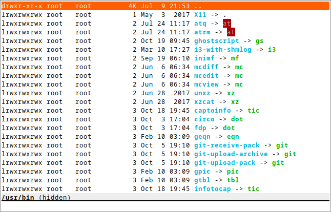

sdn
===
:compact-option:

'sdn' is a simple directory navigator that you can invoke while editing shell
commands.  It enables you to:

 * take a quick peek at directory contents without running `ls`
 * browse the filesystem without all the mess that Midnight Commander does:
   there's no need to create a subshell in a new pty.  The current command line
   can be simply forwarded if it is to be edited.  What's more, it will always
   be obvious whether the navigator is running.

The only supported platform is Linux.  I wanted to try a different, simpler
approach here, and the end result is very friendly to tinkering.

Packages
--------
Regular releases are sporadic.  git master should be stable enough.  You can get
a package with the latest development version from Archlinux's AUR.

Building
--------
Build dependencies: CMake and/or make, a C++14 compiler, pkg-config +
Runtime dependencies: ncursesw, libacl

// Working around libasciidoc's missing support for escaping it like \++
:doubleplus: ++

Unfortunately most LLVM libc++ versions have a bug that crashes 'sdn' on start.
Use GNU libstdc{doubleplus} if you're affected.

 $ git clone https://git.janouch.name/p/sdn.git
 $ mkdir sdn/build
 $ cd sdn/build
 $ cmake .. -DCMAKE_INSTALL_PREFIX=/usr -DCMAKE_BUILD_TYPE=Debug
 $ make

To install the application, you can do either the usual:

 # make install

Or you can try telling CMake to make a package for you.  For Debian it is:

 $ cpack -G DEB
 # dpkg -i sdn-*.deb

There is also a Makefile you can use to quickly build a binary to be copied
into the PATH of any machine you want to have 'sdn' on.

Configuration
-------------
For a slightly more technical explanation please refer to manual pages.

Integration
~~~~~~~~~~~
The package contains an installation script called 'sdn-install' which will bind
'sdn' to Alt-o in your shell's initialisation file.  The supported shells are:

 - *zsh*: works well
 - *bash*: minor issue: exiting the navigator confirms an empty prompt
 - *fish*: works well
 - *elvish*: version 0.14.1 and above, an unstable API is used, works well
+
elvish is absolutely perverse.  And so is integrating 'sdn' into it because it
already includes a custom file manager, bound to Ctrl-N (though I find the
ranger-like interface confusing and resource-demanding).

Colours
~~~~~~~
Here is an example of a '~/.config/sdn/look' file; the format is similar to
that of git, only named colours aren't supported:

....
cursor 231 202
bar 16 255 ul
cwd bold
input
cmdline 145
....

Filename colours are taken from the `LS_COLORS` environment variable.
Run `dircolors` to get some defaults.

Bindings
~~~~~~~~
To obtain more vifm-like controls, you may write the following to your
'~/.config/sdn/bindings' file:

....
normal h parent
normal l choose
....

Helper programs
~~~~~~~~~~~~~~~
The F3 and F4 keys are normally bound to actions 'view' and 'edit', similarly to
Norton Commander and other orthodox file managers.  The helper programs used
here may be changed by setting the PAGER and VISUAL (or EDITOR) environment
variables.

While it is mostly possible to get 'mcview' working using an invocation like
`PAGER='mcview -u' sdn`, beware that this helper cannot read files from its
standard input, nor does it enable overstrike processing by default (F9, could
be hacked around in 'mc.ext' by turning on the `nroff` switch for a custom file
extension, just without actually invoking 'nroff'), and thus it can't show the
program help.  'sdn' is currently optimised for 'less' as the pager.

Contributing and Support
------------------------
Use https://git.janouch.name/p/sdn to report any bugs, request features,
or submit pull requests.  `git send-email` is tolerated.  If you want to discuss
the project, feel free to join me at ircs://irc.janouch.name, channel #dev.

Bitcoin donations are accepted at: 12r5uEWEgcHC46xd64tt3hHt9EUvYYDHe9

License
-------
This software is released under the terms of the 0BSD license, the text of which
is included within the package along with the list of authors.
